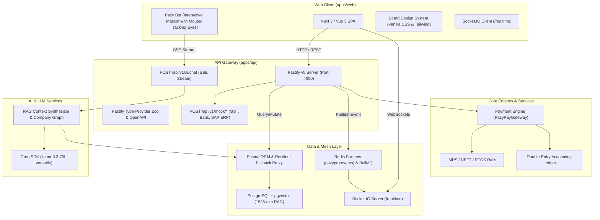

# PazyPro (FinanceOS) — Autonomous Finance Operating System

> **Core Philosophy**: *"Don't automate invoices. Understand the company."*

PazyPro is an Autonomous Finance Operating System that transforms Accounts Payable into an enterprise finance intelligence platform. It replaces manual invoice processing, fragmented approvals, and siloed banking payouts with a unified Company Intelligence Graph, an event-driven mesh architecture, and AI agents powered by RAG embeddings and Groq LLMs.

---

## 🏗️ System Architecture

PazyPro is architected as a high-performance monorepo with strict decoupling between the web application, Fastify API gateway, payment engine, event bus, database, and AI agent intelligence layers.



---

## 📦 Monorepo Directory Structure

```
FinOps/
├── apps/
│   ├── web/                    # Nuxt 3 frontend application (Vue 3, TailwindCSS, Motion One)
│   └── api/                    # Fastify API gateway (TypeScript, Zod, OpenAPI, Socket.IO)
├── services/
│   └── payment-engine/         # PazyPayGateway engine (IMPS/NEFT/RTGS rails & double-entry ledger)
├── libs/
│   ├── database/               # Prisma schema, pgvector embeddings, and resilient proxy fallback
│   ├── events/                 # Redis Streams event mesh contracts & BullMQ job queues
│   ├── ai/                     # LangGraph, RAG helpers, and AI agent pipeline
│   ├── logging/                # Structured Pino logger & OpenTelemetry instrumentation
│   ├── auth/                   # Identity, RBAC & JWT/Session management
│   └── monitoring/             # Prometheus counters & Sentry instrumentation wrappers
├── packages/
│   ├── config/                 # Shared Tailwind preset & TypeScript base configs
│   └── types/                  # Shared Zod schemas, DTOs, and DomainEvent types
├── docs/                       # Architecture decisions (ADRs), API specs, and domain blueprints
└── UI.md                       # Comprehensive design system tokens & aesthetics guide
```

---

## ✨ Key Features & Views

| Feature Module | Endpoint / Route | Architecture Highlights |
| :--- | :--- | :--- |
| **Dashboard & Pulse** | `/dashboard` | • Real-time financial outflow metric cards.<br>• 7-day settled cash flow chart (`vue-echarts`).<br>• Executive insight card & live activity timeline. |
| **Invoice Ingestion & OCR** | `/invoices` | • File upload with SHA-256 idempotency checking.<br>• OCR confidence scoring & Risk Agent flag detection.<br>• PO 3-way matching view. |
| **Payment Gateway Engine** | `/payments` | • Instant payout execution via `PazyPayGateway`.<br>• Automated rail selection (`IMPS` < ₹2L, `NEFT` standard, `RTGS` > ₹2L).<br>• Bank UTR reference code generation. |
| **Vendor Intelligence** | `/vendors` | • GSTIN/PAN verification status.<br>• Automated supplier risk scoring & blacklisting checks.<br>• Vendor directory ledger. |
| **Unified Action Center** | `/inbox` | • Multi-tier approval workflow queue.<br>• Single-click sign-off emitting `ApprovalGranted` events. |
| **Department Budgets & POs** | `/budgets` | • 2026-Q3 fiscal period allocation tracking.<br>• Departmental utilization progress bars with threshold alerts.<br>• Purchase order linking. |
| **Contracts Intelligence** | `/contracts` | • AI-extracted vendor agreement SLA terms.<br>• `pgvector` 1536-dim semantic search index.<br>• Auto-renewal clause protection. |
| **Predictive Cash Flow** | `/cash-flow` | • Probabilistic liquidity forecasting (30/60/90-day horizon).<br>• 18.4-month runway burn rate modeling. |
| **Immutable Audit Ledger** | `/audit` | • Complete event lineage tracking (`PaymentCompleted`, `VendorCreated`, `ApprovalGranted`).<br>• Redis Streams durable replay log. |
| **Pazy Bot AI Assistant** | Floating Bottom-Right | • Interactive Golden Dollar Mascot with mouse-tracking eyes.<br>• Context-aware screen content extraction.<br>• Groq LLM `llama-3.3-70b-versatile` & RAG embedding retrieval. |

---

## 🔌 Standardized Integration Mock APIs

For 100% deterministic demo execution, PazyPro includes built-in mock integration endpoints (`/api/v1/mock/*`):

- **GST Verification Mock** (`POST /api/v1/mock/gst/verify`): Validates GSTIN format and returns active taxpayer status and legal business names.
- **Bank Payout Rail Status Mock** (`POST /api/v1/mock/bank/payout-status`): Returns settlement rail details (`IMPS`/`NEFT`/`RTGS`) and clearance timestamps.
- **ERP Ledger Sync Mock** (`POST /api/v1/mock/erp/sync-invoice`): Returns SAP/NetSuite voucher numbers (`SAP-DOC-2026-90412`) and GL account posting status.

---

## 🎨 Design System & Aesthetics (`UI.md`)

PazyPro enforces a modern design aesthetic:

- **Primary Background**: Warm Cream `#FAF7F2` (`var(--bg-primary)`).
- **Typography & Carbon Text**: Carbon `#121212` (`var(--text-primary)`) with modern typography (`Inter`, `Plus Jakarta Sans`, `Space Grotesk`).
- **Pastel Accents**: Lavender `#F3E6F7` (`var(--accent-lavender)`) and Sage `#C7E8BC` (`var(--accent-sage)`).
- **Controls & Buttons**: 9999px rounded pill controls (`.btn-pill-primary`, `rounded-full`) with elevation shadows (`box-shadow: 0 12px 32px rgba(0,0,0,0.08)`).

---

## 🚀 Quickstart Guide

### Prerequisites
- **Node.js**: `v20+` or `v22+`
- **pnpm**: `v9+`

### 1. Install Dependencies
```bash
pnpm install
```

### 2. Configure Environment Variables
Copy `.env.example` to `.env` and `apps/api/.env.example` to `apps/api/.env`:
```bash
cp .env.example .env
cp apps/api/.env.example apps/api/.env
```

### 3. Run Development Servers
Start both the Fastify API backend (`http://localhost:4000`) and Nuxt 3 web frontend (`http://localhost:3000`):
```bash
# Start API backend
pnpm dev:api

# Start Web frontend (in a separate terminal)
pnpm dev:web
```

### 4. Run Test Suite
Execute unit and integration tests across web and API packages via Vitest:
```bash
pnpm test
```

### 5. Production Workspace Build
Build production bundles for all monorepo apps and packages:
```bash
pnpm build
```

---

## 📄 License

PazyPro is proprietary software licensed under the Enterprise License.
